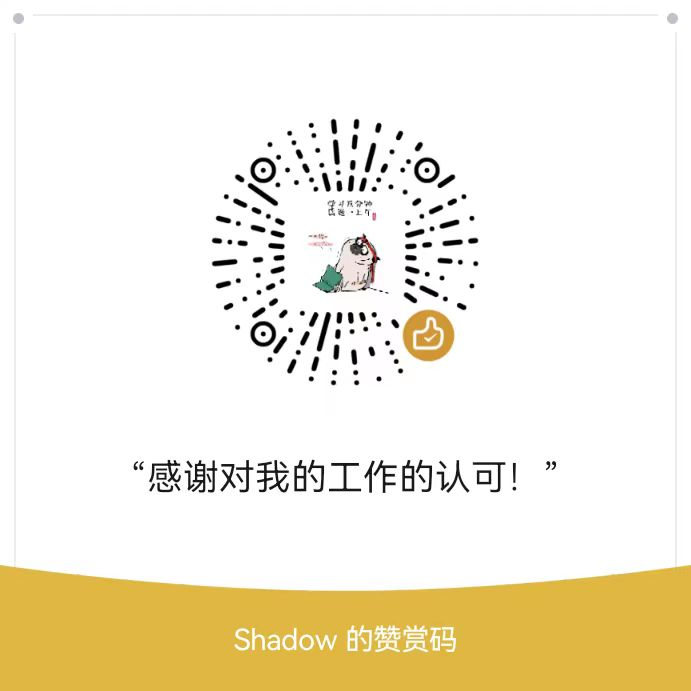

# BacklinkGenerator - 一键摘录，精准回溯

[English](../README.md) | [简体中文](./README_ZH.md)

[](https://github.com/Bowen-0x00/BacklinkGenerator/releases)

你是否曾想过，在观看视频、阅读 PDF 或演示文稿时，能够轻松地一键抓取关键信息，并自动保存到你的知识库（如 Obsidian、eagle、Anki）中？不仅如此，点击笔记中的链接，还能立刻跳转回原文的确切位置——无论是视频的特定时间点，还是 PDF 的对应页面。

**BacklinkGenerator** 就是实现这一工作流的核心工具。它负责捕获信息并生成精确的回链（Backlink）。

## ✨ 核心功能

这个工具是实现自动化知识摘录流程的关键一环。通过搭配配套的效率工具（如 Quicker）和知识库插件，它可以实现：

-   **一键捕获**：快速抓取视频帧、PDF/PPT 页面截图或选中文本。
-   **智能处理**：自动将捕获的内容和元数据（如视频时间戳、PDF 页码）发送到你的目标软件。
-   **精准回链**：在生成的笔记或卡片中，附带一个可以点击的链接，让你随时可以跳回原始上下文。
-   **广泛兼容**：支持从 PotPlayer, BookxNote, Zotero, PowerPoint 等多种软件中摘录。
-   **多端同步**：无缝将内容发送到 Obsidian, Obsidian-Excalidraw, Anki, Eagle 等笔记和素材管理工具。

## 🚀 如何开始

### 1. 快速上手

最简单的方式是直接使用已打包好的可执行文件。

1.  前往 [Releases 页面](https://github.com/Bowen-0x00/BacklinkGenerator/releases) 下载最新版本的 `app_hub.exe`。
2.  使用 Listary, Quicker 或其他你喜欢的启动器，为 `app_hub.exe` 绑定一个全局快捷键。
3.  在需要摘录时，按下快捷键并附带参数，即可完成操作。

**常用命令示例：**

-   **摘录句子到 Anki** (并生成回链):
    ```bash
    app_hub.exe --target=anki
    ```
-   **截图并保存到 Eagle** (并生成回链):
    ```bash
    app_hub.exe --target=eagle
    ```

### 2. 查看视频教程

为了帮助你更直观地理解配置和使用方法，我们制作了详细的视频教程。

[](https://www.bilibili.com/video/BV1qH4y1j7Q6/)

### 3. 探索示例库

你可以下载我们的 [Obsidian 示例库](https://github.com/Bowen-0x00/obsidian-excalidraw-example-vault) 来亲身体验完整的工作流。

1.  下载并解压 [示例库](https://github.com/Bowen-0x00/obsidian-excalidraw-example-vault)。
2.  使用 Obsidian 打开该库。
3.  查看 `摘录方式.excalidraw.md` 文件，了解不同摘录方式的可视化展示。

### 命令行参数说明

`app_hub.exe` 是所有功能的集合入口，它会自动判断当前的活动软件。

| 参数      | 说明                                                     | 默认值  | 示例                         |
| :-------- | :------------------------------------------------------- | :------ | :--------------------------- |
| `--app`   | **来源应用**：指定从哪个应用摘录，通常程序会自动检测。   | `''`    | `--app=potplayer`            |
| `--method`| **摘录方式**：使用何种方式获取摘录内容（如剪贴板、文件）。 | `paste` | `--method=http`              |
| `--target`| **目标应用**：指定将摘录内容发送到哪个应用。             | `ob`    | `--target=anki`              |
| `--extra` | **额外信息**：用于传递一些特殊指令或附加信息。           | `N/A`   | `--extra="AI anki explain"` |

## 💬 问题、反馈与交流

如果你遇到任何问题、有好的建议，或是有趣的想法希望与我交流，欢迎通过以下渠道联系我：

-   [GitHub Issues](https://github.com/Bowen-0x00/BacklinkGenerator/issues)
-   发送邮件
-   在 Bilibili 视频下留言或私信
-   通过我的个人联系方式 (微信、QQ)

## ❤️ 支持项目

如果你觉得这个项目对你有帮助，欢迎通过评论、留言与我分享你的使用体验！

你也可以请我喝杯咖啡，激励我持续维护和开发新功能。

| 微信赞助码 | Buy Me a Coffee |
| :--- | :--- |
|  | <a href='https://ko-fi.com/G2G3SY16R' target='_blank'></a> |